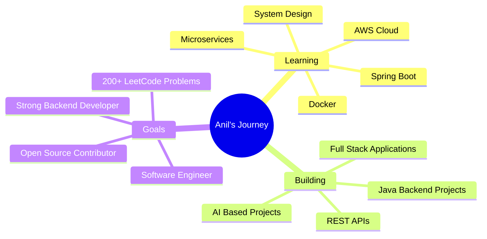

<div align="center">


# 👋 Hello, Hema Venkata Anil

### 🚀 Full Stack Developer • Java Developer • Software Engineer • AI Student


<p>


</p>

</div>

---

# 🌟 About Me


```java
public class Developer {

    String name = "Yellapu Hema Venkata Anil";

    String role = "Full Stack Developer";

    String education = "B.Tech CSE (AI)";

    String university = "Parul University";

    String location = "Andhra Pradesh, India";

    String currentFocus = "Java Full Stack Development";

    String[] skills = {

        "Java", "React", "Node.js", "MongoDB","Html" , "CSS"

        "Express", "Python","Spring Boot"

    };

    String motto = "Code • Learn • Build • Repeat";

}
```

### 💡 Who Am I?

✔️ Passionate Full Stack Developer

✔️ Java Backend Enthusiast

✔️ Strong DSA & OOP Concepts

✔️ AI Engineering Student

✔️ Backend Development Learner

✔️ Love Building Real World Projects

✔️ Quick Learner

✔️ Team Player

<br>

---

# 🌐 Connect With Me

<div align="center">

<a href="mailto:anilyallpu12345@gmail.com">

</a>

<a href="https://www.linkedin.com/in/anilyellapu/">

</a>

<a href="https://github.com/YellapuHemaVenkataAnil">

</a>

<a href="https://leetcode.com/u/Anil0112/">

</a>

<a href="https://www.geeksforgeeks.org/user/hemavenkataanil/">

</a>

<a href="https://www.codechef.com/users/venkataanil">

</a>

</div>

---

# ⚡ Tech Stack

## 👨‍💻 Languages

<p>


</p>

## 🎨 Frontend

<p>


</p>

## ⚙ Backend

<p>


</p>

## 🗄 Database

<p>


</p>

## ☁ Tools

<p>


</p>

---

# 📈 Current Focus

🌱 Java Full Stack

🌱 Backend Development

🌱 Spring Boot

🌱 Data Structures & Algorithms

🌱 System Design

🌱 Open Source Contributions

---


---

# 🚀 Featured Projects

<div align="center">

## 🌟 Projects I've Built

*Real-world applications showcasing my development skills.*

</div>

<table>

<tr>

<td width="50%">

## 🌐 Social Network Platform


### 📖 Description

A full-stack social networking platform where users can create accounts, manage profiles, share posts, interact with content, and connect with others.

### ⚙️ Tech Stack


### ✨ Features

✔ User Authentication

✔ User Profiles

✔ Post Creation

✔ Like & Comment System

✔ Responsive Design

### 🔗 Links

🌍 Live Demo

https://social-network-frontend-cc8i.vercel.app/

💻 GitHub

(Add Repository Link)

</td>

<td width="50%">

## 🚲 Bike E-Commerce Website


### 📖 Description

Modern responsive e-commerce landing page for premium bikes with beautiful UI.

### ⚙️ Tech Stack

HTML

CSS

JavaScript

### ✨ Features

✔ Responsive Layout

✔ Product Showcase

✔ Video Banner

✔ Payment Footer

✔ Modern UI

### 🔗 Links

🌍 Live Demo

https://bikes-ecommerce-website.netlify.app/

💻 GitHub

(Add Repository Link)

</td>

</tr>

<tr>

<td width="50%">

## 🚚 Supply Chain Management System


### 📖 Description

Java application for managing suppliers, inventory, logistics, reports, and warehouse operations.

### ⚙️ Tech Stack

Java

OOP

MySQL

### ✨ Features

✔ Inventory

✔ Suppliers

✔ Orders

✔ Reports

✔ Logistics

</td>

<td width="50%">

## 🧠 Parkinson's Symptom Analyzer


### 📖 Description

Analyzes patient symptoms and supports early Parkinson's disease detection using intelligent data analysis.

### ⚙️ Tech Stack

Python

Machine Learning

Data Processing

### ✨ Features

✔ Symptom Analysis

✔ Prediction Support

✔ Data Processing

✔ Healthcare Insights

</td>

</tr>

</table>

---

# 🛠 Technical Skills

<div align="center">

| Category | Technologies |
|----------|--------------|
| 👨‍💻 Languages | Java • Python • JavaScript • C • C++ |
| 🎨 Frontend | HTML • CSS • Bootstrap • React |
| ⚙ Backend | Node.js • Express • Django • Flask |
| 🗄 Database | MongoDB • MySQL |
| 🔧 Tools | Git • GitHub • VS Code • Postman |
| 📚 Core Skills | OOP • DSA • REST APIs • Problem Solving |

</div>

---

# 🎓 Education

## 🎓 Bachelor of Technology

**Parul University**

Computer Science Engineering (AI)

📅 2022 – 2026

🎯 CGPA **8.50**

---

## 🏫 Intermediate

Sri Chaitanya Junior College

MPC

**88.6%**

---

## 🏫 SSC

Andhra Pradesh Model School

**95%**

---


---

# 💼 Internship Experience

<table>
<tr>
<td width="100%">

## 🚀 SAP Backend Developer Intern

### 🏢 Edunet Foundation

📅 **Nov 2024 – Aug 2025**

### 💻 Responsibilities

- 🔹 Completed SAP Software Track (Backend Development)
- 🔹 Worked with Git & GitHub
- 🔹 Built Backend Applications
- 🔹 Database Design & Management
- 🔹 REST API Development
- 🔹 Team Collaboration
- 🔹 Agile Development Practices

### 📚 Skills Gained

Java • Backend Development • Git • GitHub • SQL • APIs • Software Engineering

</td>
</tr>
</table>

---

# 🏆 Certifications

<table>

<tr>

<td>

## ☕ Java Full Stack

🏢 Wipro

📅 2025

Backend Development

Java

Spring Concepts

REST APIs

Git

</td>

<td>

## 🌐 Computer Networks

🏢 NPTEL

Elite + Silver

Score **79%**

</td>

</tr>

<tr>

<td>

## ☁ Internet of Things

🏢 NPTEL

Elite

Score **69%**

</td>

<td>

## 📘 Theory of Computation

🏢 NPTEL

Completed Successfully

</td>

</tr>

</table>

---

# 🏅 Achievements

🥇 Yuva Unstoppable Scholarship Recipient

🏆 Successfully completed Java Full Stack Training

🎖 Completed SAP Backend Internship

📜 NPTEL Elite Certifications

💻 Built Multiple Full Stack Projects

🚀 Active DSA Learner

---

# 👨‍💻 Coding Profiles

<div align="center">

[](https://leetcode.com/u/Anil0112/)

[](https://www.geeksforgeeks.org/user/hemavenkataanil/)

[](https://www.hackerrank.com/profile/anilyallapu12345)

[](https://www.codechef.com/users/venkataanil)

</div>

---

# 📊 GitHub Analytics

<div align="center">


<br>


</div>

---

# 💬 Random Dev Quote

<div align="center">


</div>

# 🎯 2026 Roadmap



---

# 🌱 Currently Learning

<div align="center">

| 🚀 Technology | 📖 Status |
|--------------|-----------|
| Java Full Stack | ✅ In Progress |
| Spring Boot | 🌱 Learning |
| System Design | 🌱 Learning |
| Docker | 🌱 Learning |
| AWS | 🌱 Learning |
| Data Structures & Algorithms | 🔥 Daily Practice |

</div>

---

# 💼 Open To

<div align="center">

🟢 Software Engineer Roles

🟢 Full Stack Developer Roles

🟢 Backend Developer Roles

🟢 Java Developer Roles

🟢 Internship Opportunities

🟢 Open Source Collaboration

</div>

---

# 🤝 Let's Connect

<div align="center">

<a href="mailto:anilyallpu12345@gmail.com">

</a>

<a href="https://www.linkedin.com/in/anilyellapu/">

</a>

<a href="https://github.com/YellapuHemaVenkataAnil">

</a>

<a href="https://leetcode.com/u/Anil0112/">

</a>

</div>

---

# 💡 Fun Fact

```java
while(alive){

    Learn();

    Build();

    Improve();

    Repeat();

}
```

---

<div align="center">

## ⭐ If you like my work, consider giving a ⭐ to my repositories!

### Thanks for visiting my profile ❤️


<br><br>


</div>

---

<div align="center">

### ⚡ "First, solve the problem. Then, write the code."

**Made with ❤️ by Yellapu Hema Venkata Anil**

</div>
